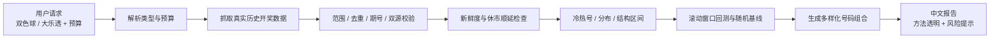

# China Lottery Insight Skill

[](https://github.com/trangalinh-maker/china-lottery-insight-skill/releases)
[](LICENSE)
[](https://nodejs.org/)
[](SKILL.md)
[](#responsible-use)

A Chinese-language Codex skill for analyzing `大乐透(dlt)` and `双色球(ssq)` with real historical draw data, cross-source validation, freshness checks, holiday-aware scheduling, and budget-aware ticket suggestions.

它的定位不是“稳赚预测器”，而是一个透明、可验证、带风险提示的彩票数据分析助手：把数据来源、校验状态、统计偏离、回测口径和娱乐性号码参考放在同一份中文报告里。

## Why This Exists

| Pain point | What this skill does |
| :--- | :--- |
| 开奖数据容易过期 | 检查最新开奖日期、开奖节奏和允许遗漏阈值 |
| 单一数据源不够放心 | 对双色球/大乐透做跨来源校验和覆盖率提示 |
| 春节/国庆休市容易算错 | 支持休市窗口和下期开奖顺延计算 |
| “热号冷号”容易被误解 | 同时给出概率提示、显著性信息和随机性声明 |
| 推荐号码缺少解释 | 为每组号码标注策略、结构约束和预算建议 |

## Feature Map



## Quick Start

```bash
# Clone the skill
git clone https://github.com/trangalinh-maker/china-lottery-insight-skill.git
cd china-lottery-insight-skill

# 大乐透，预算10元
node lotteryPredict.js dlt 10

# 双色球，预算20元
node lotteryPredict.js ssq 20

# 回归检查：解析、校验、新鲜度、休市顺延、回测字段
node regression-check.js
```

## Example Output

```text
# 大乐透 预测分析报告

## 基本信息
- 分析期数: 近500期（真实数据）
- 数据来源: 中国体彩网官方接口 + 500彩票网历史页（交叉校验）
- 下期开奖: 2026年04月22日（周三）21:30

## 推荐号码
| 方案 | 前区 | 后区 | 说明 |
| 1 | 10 16 22 25 34 | 04 11 | 混合策略（结构约束通过） |

风险提示: 彩票是独立随机事件，分析结果仅供娱乐参考，请理性投注。
```

## Optional Config

```bash
cp lottery-predict-config.example.json lottery-predict-config.json
cp lottery-closure-rules.example.json lottery-closure-rules.json
```

- `lottery-predict-config.json`: adjust analysis windows, backtest settings, strategy mix, and freshness tolerance.
- `lottery-closure-rules.json`: override yearly lottery closure windows, such as Spring Festival or National Day market pauses.

## What This Skill Emphasizes

- Real historical data first; no silent fallback to simulated draws.
- Cross-source validation and coverage reporting where available.
- Holiday-aware next-draw calculation with explicit closure reminders.
- Backtest output that includes uncertainty instead of overclaiming edge.
- Clear responsible-use language: numbers are for entertainment reference only.

## Repository Layout

```text
.
├── SKILL.md                              # Codex skill definition and workflow
├── lotteryPredict.js                     # Main Node.js CLI and analysis engine
├── regression-check.js                   # Lightweight regression suite
├── lottery-predict-config.example.json   # Runtime tuning example
├── lottery-closure-rules.example.json    # Holiday/closure override example
├── agents/openai.yaml                    # Optional OpenAI agent metadata
└── references/
    ├── configuration.md                  # Configuration reference
    ├── data-pipeline.md                  # Retrieval and validation rules
    └── report-template.md                # Report field conventions
```

## Use As A Codex Skill

Install or copy this repository under your Codex skills directory, for example:

```bash
mkdir -p "$CODEX_HOME/skills"
git clone https://github.com/trangalinh-maker/china-lottery-insight-skill.git \
  "$CODEX_HOME/skills/china-lottery-insight-skill"
```

Then ask Codex in Chinese, for example:

```text
用 china-lottery-insight 分析一下下一期双色球，预算20元
```

## Development

```bash
node regression-check.js
node lotteryPredict.js dlt 10
node lotteryPredict.js ssq 20
```

Run the regression suite after changing parsing, validation, freshness, holiday, or backtest behavior.

## Responsible Use

Lottery draws are independent random events. This project does not guarantee winnings, expected profit, or deterministic patterns. The analysis and suggested numbers are for entertainment and educational reference only. Please follow local laws and bet responsibly.

## License

MIT License. See [LICENSE](LICENSE).
